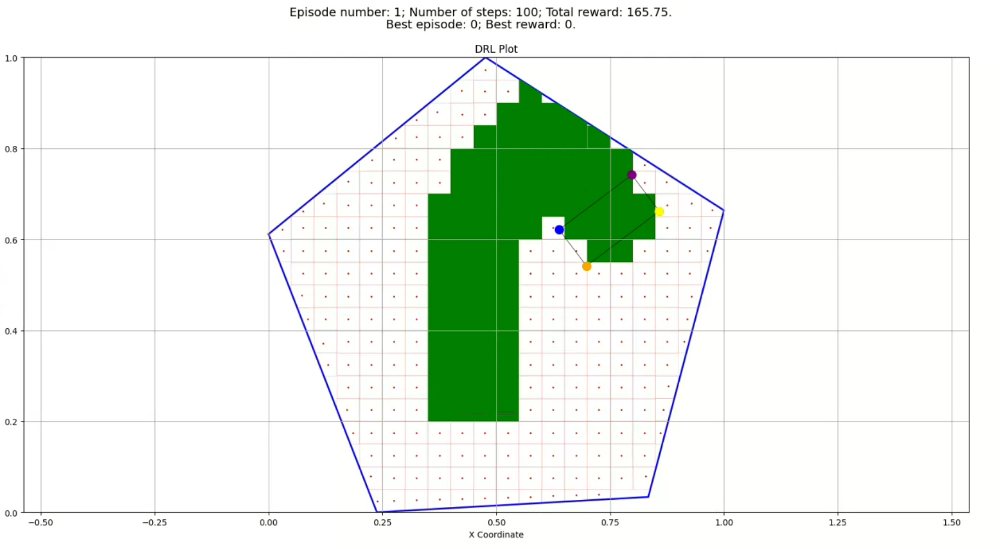
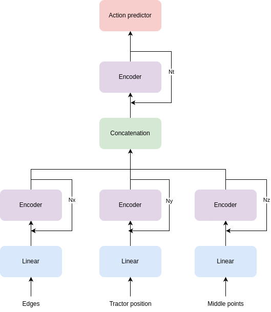

## Table of contents
- [Introduction](#introduction)
- [Functionality](#functionality)
- [Description of Files](#description-of-files)
## Introduction
In this repository a brand-new environment has been created to train agricultural machinery agents, using gymnasium library (from OpenAi) and stable-baselines3.  
The field is divided into small patches, and the goal of the agent is to pass through all those patches in the fewest steps possible. In the next Figure, a sample of the render of the environment and the agent can be seen. 

When the agent has passed through a pathc, it is colored green, and white otherwise. Further information is offered in renders, such as number of episodes finished, best episode (and its reward) and total number of steps done.

## Functionality
Lots of different configurations and funcionalities are offered. They can all be changed in the [config.yaml](ENVIRONMENT/config.yaml).
- Choose between a custom PPO policy to mask forbidden actions, or default one.
- Choose the different rewards and penalties the agent gets for each action, including dense and sparse rewards.
- Choose to use random fields or a custom one. If using random fields, the number of vertices, edge sizes and are ara customizable.
- Movements of the agent can also be chosen, as well as its step size and rotation angle.
- Sizes of the feature extractor network and action predictor can be customized.
- Hyperparameters of the PPO policy can also be changed.

## Description of files
In this section, the distinct files that make up this environment will be explained.

- [launcher.py](ENVIRONMENT/launcher.py). It loads the configuration set in [config.yaml](ENVIRONMENT/config.yaml) and starts the training loop.
- [agraria_environment.py](ENVIRONMENT/environment.py). It is the environment itself, which inherits from gymnasium.env to create the environment. The step function, which updates the state of environment and calculates the reward for each step is implemented. The reset function to start a new episode is also implemented. Further functions to calculate rewards, position of the tractor or the functions to create a brand-new layout for the field are also included in this file.
- [grid_field](ENVIRONMENT/grid_field.py). It is in charge of all functionality related with the grid, including the division into patches, the normalization, rendering etc. It also provides functions to create the tractor.
- [utils.py](ENVIRONMENT/utils.py). Provides the functionality to move the tractor through the environment, as well as functions to check if an action is legal (the tractor does not go out of bounds)
- [feature_extractor.py](ENVIRONMENT/feature_extractor.py). A brand-new feature extractor has been developed for this proyect. The observation space for the agent will be a dictionary, which consists of:
    - Vertices of the field. Shape: (n_vertices,2).
    - Position of the tractor. Shape: (4,2).
    - Middle point of each patch, and whether it is already passed. Shape (number_of_patches,3).  
To process all these information and extract valuable features for the action predictor, an encoder module has been developed. Each component of the dictionary will first go through a series of stacked encoders (size of embeddings and number of encoders can be chosen in [config.yaml](NVIRONMENT/config.yaml)). The next figure shows the structure of the encoder module.

As said before, several of these can be stacked. Once each feature has been processed separately, the embeddings are concatenated and passed through more encoders modules. Again, the number of modules stacked and its sizes are customizable. In the next figure, the full structure of the feature extractor are depicted.

The outputs of the feature extractor will be passed to the action predictor, which has 2 networks:
- net_arch_pi: It is in charge of the action prediction. Its number of layers and their neurons can be selected in [config.yaml](ENVIRONMENT/config.yaml).
- net_arch_vf: It is in charge of the value prediction. Its number of layers and their neurons can be selected in [config.yaml](ENVIRONMENT/config.yaml).

- [masked_PPO_policy.py](ENVIRONMENT/masked_PPO_policy.py). A modification of the PPO policy has been made to avoid the agent from going out of bounds. For each step, the result of all possible actions are calculated, and if the result of an actions makes the agent go out of bounds, the probability of selecting that action is set to -inf. PPO policy is used in stochastic way, meaning that the action selection will be made based on the probabilities of each action. On the other hand deterministic selection would always choose the action with highest probability.

# 👥 Author
* Jaime Alvarez Uruena     [@JaimeAlvarez18](https://github.com/JaimeAlvarez18)

